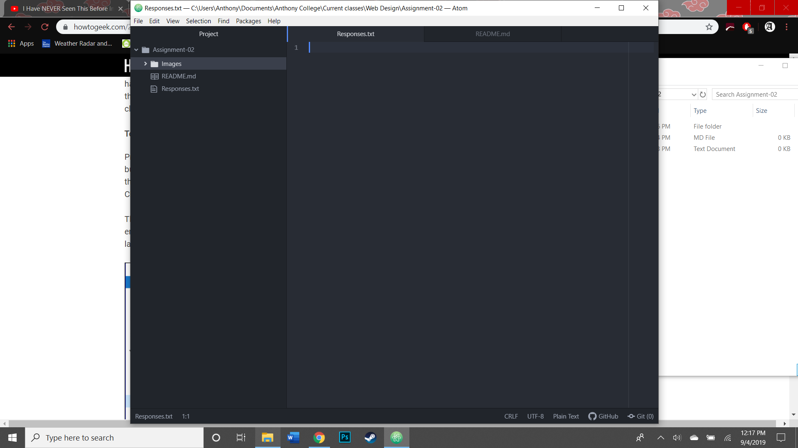

# Assignment-02
## Anthony Stroppel

The reason why I took this course is because it was on my degree plan to major in Digital Art. I initially registered for the in class lecture. However, I figured out that the department (from what I know at least) decided to cancel the course the day of classes. So far though, I am liking this a lot more than what I probably would've in a lecture.

List of things I have learned or hope to learn:

1. I learned about how to Atom, which so far, I am enjoying far more than any other software I used for previous coding courses.
2. I learned how to use GitHub (for the most part).
3. I hope to learn more about how to use typography later in the semester. I use that in my Digital Art making and I'd like to learn other things about it.

[Youtube Home Page](https://www.youtube.com)

[My response file](./Responses.txt)

